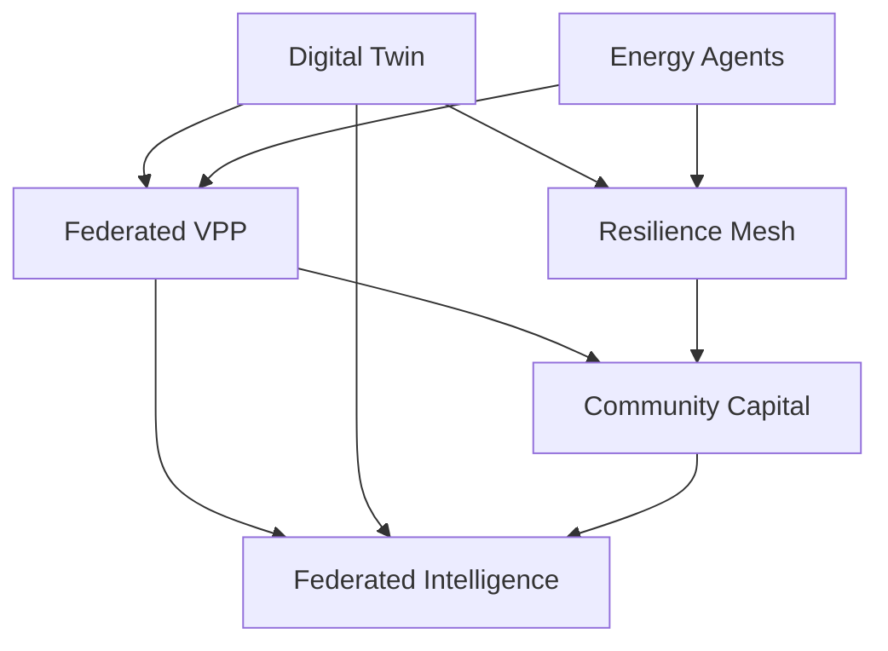

# EnergiaNostra — Moonshot Analysis

## Executive summary

EnergiaNostra is no longer “just” a CER back-office. The repository already contains the primitives of a **community-energy operating system**: identity, metering, trading, smart-grid control, simulation, payments, compliance, storage, notifications, OpenAPI, observability, multi-tenancy, and deployment infrastructure. The strategic opportunity is to stop optimizing the current workflow and instead turn the platform into the software layer that **coordinates local energy, local capital, and local resilience at territorial scale**.

**Verdict:** pursue a moonshot portfolio built around six reinforcing bets:
1. **Federated CER VPP**
2. **Territorial Energy Digital Twin**
3. **Resilience Mesh & Civic Islanding**
4. **Personal Energy Agents**
5. **Community Capital Stack**
6. **Federated CER Intelligence Network**

This document reflects repository study plus market research, and the repo now contains first implementation slices for all six features.

---

## 1. Deep repository understanding

### 1.1 What the codebase is today

EnergiaNostra is a **Next.js 16 App Router** product with a server-first architecture and a wide domain footprint:

- **UI / routing:** `src/app/**` with dashboard pages, public pages, and route handlers.
- **Service layer:** `src/lib/**` contains domain modules for auth, billing, trading, simulation, smart grid, GSE, GDPR, observability, developer platform, i18n, etc.
- **Persistence:** `prisma/schema.prisma`, `src/lib/prisma.ts`, `prisma/seed.ts`, generated client in `src/generated/prisma/**`.
- **Infra:** `docker-compose.yml`, `infra/terraform/main.tf`, `infra/helm/**`, `Dockerfile`.
- **Tests:** Vitest suite in `tests/unit/**` and Playwright scaffolding in `e2e/**`.

### 1.2 Architectural strengths visible in the repo

#### A. Strong domain breadth
The Prisma schema spans core CER operations and adjacent platform capabilities:

- CER entities: `Cer`, `Member`, `EnergyReading`, `MeterReading`, `GseReport`, `Invoice`, `Payment`
- Governance: `Document`, `Vote`, `BallotCast`, `Announcement`
- Platform/compliance: `AuditLog`, `Notification`, `ApiKey`, `WebhookSubscription`, `HealthMetric`
- Advanced energy features: `EnergyForecast`, `EnergyOffer`, `TradeMatch`, `CarbonCredit`, `OptimizationModel`, `SmartDevice`, `DemandResponseEvent`, `Simulation`
- SaaS/network primitives: `Tenant`, `TenantUsage`, `OAuthClient`, `MarketplaceApp`, `CountryConfig`

This matters: moonshots do not need a cold start. The repo already contains the vocabulary for orchestration, market participation, compliance, and ecosystem expansion.

#### B. Modular service layer
The project has a clear pattern of **lib module → API route → dashboard page**. Examples:

- Smart grid: `src/lib/smart-grid.ts` → `src/app/api/smart-grid/route.ts` → `src/app/dashboard/smart-grid/page.tsx`
- Simulation: `src/lib/cer-simulation.ts` → `src/app/api/simulation/route.ts` → `src/app/dashboard/simulation/page.tsx`
- Payments: `src/lib/payments.ts` → `src/app/api/payments/route.ts` → `src/app/dashboard/payments/page.tsx`
- OpenAPI: `src/lib/openapi.ts` → `src/app/api/openapi/route.ts`

That pattern makes moonshot implementation tractable: the repo already wants to grow as a portfolio of bounded capabilities.

#### C. Deployment ambition already exists
The codebase includes:

- Dockerized app + PostgreSQL + Redis + MinIO + backup service (`docker-compose.yml`)
- Hetzner Terraform for staging/production VM bootstrapping (`infra/terraform/main.tf`)
- Helm deployment template (`infra/helm/templates/deployment.yaml`)

This is critical because moonshots in energy require a path from prototype to operator-grade hosting.

#### D. Observability and API posture are already present
The repo already exposes:

- Prometheus-style metrics (`src/app/api/metrics/route.ts`, `src/lib/observability-v2.ts`)
- Status and health endpoints (`src/app/api/status/route.ts`, `src/app/api/health/route.ts`)
- OpenAPI generation (`src/lib/openapi.ts`)
- Developer platform primitives (`src/lib/developer-platform.ts`, `src/app/api/developer-platform/route.ts`)

That is a latent foundation for turning EnergiaNostra into a platform, not a monolithic dashboard.

### 1.3 Key constraints and strategic implications

#### Constraint 1: breadth exceeds hardening
The repo has many domains, but many features are still prototype-grade. This is visible in the pattern of deterministic simulations, mock integrations, and synthetic seeded data. Strategic implication: moonshots must be framed as **control-plane wedges** that leverage breadth rather than pretending the product is already a utility-grade system.

#### Constraint 2: data model is rich, but the live operating model is still demo-centric
`src/lib/data-db.ts` and `prisma/seed.ts` demonstrate strong demo readiness and strong domain reasoning, but the product still relies heavily on seeded scenarios. Strategic implication: the right moonshots are those that can start as **simulation/control products** and harden into live operations over time.

#### Constraint 3: Next.js App Router favors server-first composition
The repository uses route handlers for programmatic access and server-rendered pages for product surfaces. Strategic implication: new features should keep heavy coordination logic in `src/lib/**`, expose APIs through route handlers, and avoid building new client-heavy state machines unless necessary.

#### Constraint 4: the moat is not UI polish — it is orchestration + data network effects
The repo’s unique value is the unusual combination of:

- CER governance
- regulatory/compliance workflows
- metering and financial logic
- smart-grid and flexibility surfaces
- developer/API layer
- multi-tenant and multilingual ambitions

That combination points toward an **energy coordination network**, not incremental dashboard optimization.

### 1.4 Latent capabilities that justify moonshots

The repository already has the seeds of six strategic expansion vectors:

1. **Grid orchestration:** `smart-grid.ts`, `ai-optimization.ts`, `trading.ts`
2. **Scenario planning:** `cer-simulation.ts`, `forecasting.ts`, `pvgis.ts`
3. **Territorial operations:** multi-CER / multi-tenant / country config primitives
4. **Financial settlement:** billing, payments, reconciliation, carbon credits
5. **Institutional trust:** SPID/CIE auth routes, voting, GDPR, observability
6. **Platform/networking:** OpenAPI, webhooks, marketplace, i18n, infra

These are exactly the ingredients needed for market-redefining bets.

---

## 2. Market and competitive research

### 2.1 Market signals

- The European Commission states that **8,000+ energy communities already exist across the EU**, and REPowerEU pushed for roughly **one energy community in every municipality above 10,000 inhabitants by 2025**. Source: European Commission Energy Communities portal — https://energy.ec.europa.eu/topics/markets-and-consumers/energy-consumers-and-prosumers/energy-communities_en
- The IEA argues local energy communities can accelerate clean-energy adoption by increasing citizen participation, acceptance, and local coordination capacity. Source: IEA commentary — https://www.iea.org/commentaries/empowering-people-the-role-of-local-energy-communities-in-clean-energy-transitions
- Grid modernization is moving down to the distribution layer: the IEA highlights digitalisation as a major enabler and stresses that secure energy transitions require **smarter, more digital distribution grids**. Sources: https://www.iea.org/energy-system/decarbonisation-enablers/digitalisation and https://www.iea.org/reports/electricity-grids-and-secure-energy-transitions
- Virtual power plants are becoming a core future-system pattern. Berkeley Lab and NREL both position VPPs / DER aggregations as major grid-flexibility levers. Sources: https://emp.lbl.gov/news/new-berkeley-lab-reports-virtual-power-plants-and-der-aggregations and https://docs.nrel.gov/docs/fy25osti/92831.pdf
- Community resilience and microgrids are increasingly central to municipal energy strategy. NREL’s resilience menu is especially relevant for a CER platform that already touches public and civic actors. Source: https://docs.nrel.gov/docs/fy23osti/84493.pdf
- Community-energy finance is moving beyond grants into cooperative and blended-capital structures. Good sources here are ManagEnergy / EC, REScoop, IRENA, and community-energy financing reports:
  - https://managenergy.ec.europa.eu/publications/energy-communities-action-lessons-60-local-projects_en
  - https://bankwatch.org/wp-content/uploads/2023/03/Briefing-Public-Financing-Opportunities-for-Energy-Communities-in-Europe.pdf
  - https://www.ideassonline.org/public/pdf/IRENA-CommunityEnergyBenefits2024-ENG.pdf

### 2.2 Competitive map

The competitive landscape is fragmented by layer, not integrated:

| Category | Representative players / references | What they do | Gap EnergiaNostra can attack |
|---|---|---|---|
| Grid / identity infrastructure | Energy Web — https://www.energyweb.org/ | Trust, identity, grid coordination primitives | Not a CER-native operating system with governance, billing, compliance, and civic workflows |
| Local flexibility marketplace | Piclo Flex — https://piclo.energy/flex/ | DSO-facing flexibility procurement | Doesn’t own CER formation, governance, payments, and member lifecycle |
| Utility operating system | Kraken — https://kraken.tech/ | Large-scale utility orchestration | Utility-first, not community-first, and not Italy/CER-governance specific |
| Cooperative ecosystem | REScoop.eu — https://www.rescoop.eu/ | Federation / policy / cooperative support | Network, not operating software |
| Traditional Italian route | consultants + spreadsheets + portals | Manual setup and recurring administrative work | No integrated control plane, poor compounding data moat |

### 2.3 Strategic insight from the market

The market is **not** missing another CER dashboard.
It is missing a platform that can do all of the following in one system:

- coordinate distributed assets in real time,
- plan territory-scale build-out,
- protect civic infrastructure,
- mobilize local capital,
- and compound intelligence across many CERs.

That is the white space.

---

## 3. Innovation vectors

### Vector 1 — From monthly reporting to real-time orchestration
Move from “what happened last month?” to “what should the territory do in the next 15 minutes?”

### Vector 2 — From single CER admin tool to territorial operating system
Use municipalities, civic buildings, feeder constraints, and shared storage as first-class product objects.

### Vector 3 — From savings calculator to local capital engine
Turn future energy cash flows, resilience value, and flexibility revenues into financeable assets.

### Vector 4 — From member portal to autonomous agent network
Make each member an active energy node, represented by preferences, delegations, and machine-speed negotiation.

### Vector 5 — From SaaS to network business
Let each additional CER improve benchmarks, liquidity, policy simulation, and cross-community learning for the rest.

---

## 4. Moonshot proposals

## 4.1 Moonshot #1 — Federated CER VPP

### Vision
Aggregate multiple CERs into a **federated virtual power plant** that sells flexibility, resilience reserve, and congestion services while maximizing shared-energy economics.

### Why it fits this repo
- Smart-grid primitives already exist (`src/lib/smart-grid.ts`)
- AI optimization exists (`src/lib/ai-optimization.ts`)
- Trading and settlement concepts exist (`src/lib/trading.ts`, `src/lib/payments.ts`)
- Multi-tenant primitives exist for federation (`src/lib/multi-tenant.ts`)

### Product requirements
- Aggregate controllable solar, batteries, EV charging, and flexible loads
- Build day-ahead and intra-day dispatch windows
- Create market lanes for DSO local flexibility, resilience reserve, and peak shaving
- Track dispatch readiness and settlement confidence
- Support CER-level and federation-level participation rules

### Architecture
- **Data plane:** meter + asset telemetry + member flexibility envelopes
- **Optimization plane:** forecasting + dispatch scoring + market bid composer
- **Settlement plane:** value attribution back to CER/member/accounting layer
- **Governance plane:** federated operating rules, delegations, and auditability

### APIs
- Implemented now: `GET /api/vpp`
- Future expansion:
  - `POST /api/vpp/bids`
  - `POST /api/vpp/dispatch`
  - `GET /api/vpp/settlement?period=YYYY-MM`

### Implementation plan
1. **Now (prototype landed):** dashboard + API + readiness model + bid surfaces
2. **Next:** integrate live smart-device telemetry and DR events
3. **Later:** add market adapters, settlement, and federated compliance

### Files implemented now
- `src/lib/moonshot-vpp.ts`
- `src/app/api/vpp/route.ts`
- `src/app/dashboard/vpp/page.tsx`

---

## 4.2 Moonshot #2 — Territorial Energy Digital Twin

### Vision
Create a **territorial digital twin** of rooftops, member assets, demand growth, storage, and feeder constraints so CERs, municipalities, and installers can plan a 10-year build-out instead of reacting month by month.

### Why it fits this repo
- Simulation engine exists (`src/lib/cer-simulation.ts`)
- Forecasting exists (`src/lib/forecasting.ts`)
- PVGIS integration exists (`src/lib/pvgis.ts`)
- Multi-territory primitives exist in CER / country / tenant models

### Product requirements
- Model zones, hosting capacity, electrification readiness, and capex backlog
- Compare long-horizon scenarios (rooftops, EV, heat pumps, resilience retrofits)
- Expose bottlenecks to DSO / municipality / cooperative operators
- Produce investable, territory-aware asset roadmaps

### Architecture
- **Asset graph:** members, buildings, civic roofs, storage, EV loads, feeder proxies
- **Scenario engine:** electrification, climate stress, tariff and incentive assumptions
- **Decision layer:** capex queue, capacity unlock sequence, value-at-risk

### APIs
- Implemented now: `GET /api/digital-twin`
- Future expansion:
  - `POST /api/digital-twin/scenarios`
  - `POST /api/digital-twin/import-assets`
  - `GET /api/digital-twin/export/feeder-plan`

### Implementation plan
1. **Now:** zone model + scenario shell + bottleneck inventory
2. **Next:** ingest spatial assets and real PVGIS / feeder data
3. **Later:** planning workflows for municipal and DSO partners

### Files implemented now
- `src/lib/energy-digital-twin.ts`
- `src/app/api/digital-twin/route.ts`
- `src/app/dashboard/digital-twin/page.tsx`

---

## 4.3 Moonshot #3 — Resilience Mesh & Civic Islanding

### Vision
Turn the CER into a **civic resilience mesh** capable of protecting schools, clinics, municipal operations, telecom, and water infrastructure during outages, heat waves, or grid stress.

### Why it fits this repo
- Smart-grid control is already represented
- Notifications, compliance, governance, and observability already exist
- The product already touches municipalities and public-style workflows

### Product requirements
- Model critical sites, critical loads, and island clusters
- Maintain black-start and emergency operating procedures
- Expose resilience score, coverage, protected-citizen metrics, and avoided losses
- Eventually integrate DR + islanding + civic incident command

### Architecture
- **Critical-load registry**
- **Storage / DER reserve allocator**
- **Island-cluster orchestrator**
- **Emergency-mode policy engine** with governance/audit hooks

### APIs
- Implemented now: `GET /api/resilience`
- Future expansion:
  - `POST /api/resilience/drills`
  - `POST /api/resilience/activate-island`
  - `GET /api/resilience/incidents`

### Implementation plan
1. **Now:** resilience dashboard and control model
2. **Next:** integrate live critical-site topology + incident flows
3. **Later:** municipal partner workflows, drills, SLA-backed continuity products

### Files implemented now
- `src/lib/resilience-mesh.ts`
- `src/app/api/resilience/route.ts`
- `src/app/dashboard/resilience/page.tsx`

---

## 4.4 Moonshot #4 — Personal Energy Agents

### Vision
Give every member a **personal energy agent** that negotiates on their behalf across comfort, savings, resilience, and community rules.

### Why it fits this repo
- AI optimization already exists
- Notifications, voting, and auth/governance already exist
- The repo already has the concept of recommendations and user-level preferences

### Product requirements
- Agent profiles with strategy modes (comfort-first, value-max, resilience-first)
- Negotiation windows for solar soak, peak avoidance, resilience standby
- Governance-aware delegations and revocable permissions
- Future ability to negotiate with VPP, storage, tariffs, and flexibility markets

### Architecture
- **Preference graph** per member
- **Negotiation engine** across windows and guardrails
- **Audit trail** for delegated actions
- **Reward/settlement connector** to billing, incentives, and notifications

### APIs
- Implemented now: `GET /api/energy-agents`
- Future expansion:
  - `POST /api/energy-agents/preferences`
  - `POST /api/energy-agents/delegations`
  - `POST /api/energy-agents/negotiate`

### Implementation plan
1. **Now:** dashboard + agents + negotiation windows + governance hooks
2. **Next:** persistent member preferences and action history
3. **Later:** live autonomous coordination with VPP / dynamic tariffs / resilience events

### Files implemented now
- `src/lib/energy-agents.ts`
- `src/app/api/energy-agents/route.ts`
- `src/app/dashboard/energy-agents/page.tsx`

---

## 4.5 Moonshot #5 — Community Capital Stack

### Vision
Make EnergiaNostra the platform where communities **raise, structure, and recycle local capital** into new assets: batteries, public rooftops, resilience infrastructure, and future flexibility revenue streams.

### Why it fits this repo
- Billing, payments, reconciliation, grants, and carbon-credit logic already exist
- Governance and documents already exist
- CER economics are already modeled in energy and incentive modules

### Product requirements
- Capital instruments: member notes, municipal anchor notes, future-cash-flow revenue shares
- Campaign management and treasury rules
- Visibility into ownership %, blended cost of capital, reserve runway, deployment velocity
- Future legal/compliance templates for regulated capital pathways

### Architecture
- **Treasury layer**
- **Instrument catalog**
- **Campaign engine**
- **Revenue routing** from incentives, flexibility, carbon, and payments

### APIs
- Implemented now: `GET /api/community-capital`
- Future expansion:
  - `POST /api/community-capital/campaigns`
  - `POST /api/community-capital/commitments`
  - `GET /api/community-capital/cap-table`

### Implementation plan
1. **Now:** instrument dashboard + campaign surfaces + velocity logic
2. **Next:** investor/member commitment flows and treasury automation
3. **Later:** regulated issuance workflows, secondary liquidity, institutional reporting

### Files implemented now
- `src/lib/community-capital.ts`
- `src/app/api/community-capital/route.ts`
- `src/app/dashboard/community-capital/page.tsx`

---

## 4.6 Moonshot #6 — Federated CER Intelligence Network

### Vision
Build a **privacy-safe intelligence layer across many CERs** so every new community improves benchmarking, policy simulation, liquidity, and market credibility for all the others.

### Why it fits this repo
- Multi-tenant and country configuration already exist
- OpenAPI, developer platform, and i18n already exist
- Observability and status primitives are already present

### Product requirements
- Benchmark clusters by CER archetype
- Policy sandbox for incentives, storage premia, electrification programs, flexibility tariffs
- Liquidity and federation score metrics
- Exportable evidence for policymakers, municipalities, and financiers

### Architecture
- **Federated benchmark layer**
- **Scenario / policy simulation layer**
- **Privacy-safe network analytics**
- **Partner API layer** for policy, municipal, and investor consumers

### APIs
- Implemented now: `GET /api/federation`
- Future expansion:
  - `POST /api/federation/benchmarks`
  - `POST /api/federation/policy-simulations`
  - `GET /api/federation/export`

### Implementation plan
1. **Now:** benchmark + policy simulation shell
2. **Next:** tenant-aware benchmarking and partner-facing exports
3. **Later:** cross-country policy intelligence and liquidity routing

### Files implemented now
- `src/lib/federated-intelligence.ts`
- `src/app/api/federation/route.ts`
- `src/app/dashboard/federation/page.tsx`

---

## 5. Portfolio view

### 5.1 Dependency graph

### 5.2 Recommended build sequence

1. **Digital Twin** — creates the territorial model and capex logic
2. **Energy Agents** — creates member-level controllability
3. **Federated VPP** — converts controllability into marketable orchestration
4. **Resilience Mesh** — turns orchestration into civic resilience value
5. **Community Capital** — finances the infrastructure loop
6. **Federated Intelligence** — compounds data and policy advantage across many CERs

### 5.3 Why this sequencing works

- The digital twin explains **where** value can be built.
- agents create the ability to act at the edge.
- the VPP monetizes that ability.
- resilience adds public-sector and civic urgency.
- capital turns future value into current deployment.
- the federation network makes all of the above compound.

---

## 6. Strategic verdict and scorecard

### 6.1 Scorecard

| Feature | Strategic upside | Repo fit | Moat potential | Complexity | Score / 10 |
|---|---:|---:|---:|---:|---:|
| Federated VPP | 10 | 9 | 10 | 9 | **9.6** |
| Energy Digital Twin | 9 | 9 | 9 | 8 | **9.0** |
| Resilience Mesh | 9 | 8 | 9 | 8 | **8.8** |
| Personal Energy Agents | 9 | 8 | 8 | 8 | **8.6** |
| Community Capital Stack | 10 | 8 | 10 | 9 | **9.1** |
| Federated Intelligence Network | 10 | 9 | 10 | 9 | **9.4** |

### 6.2 Strategic verdict

**Go, but not as a feature factory.**

EnergiaNostra should position itself as:

> **the operating system for community energy territories**

—not merely the dashboard for a single CER administrator.

The winning long-horizon strategy is to combine:
- **coordination of assets** (VPP),
- **coordination of territory** (digital twin),
- **coordination of citizens** (agents),
- **coordination of resilience** (mesh),
- **coordination of capital** (community finance),
- **coordination of intelligence** (federation network).

That stack is meaningfully more ambitious than anything implied by spreadsheets, compliance portals, or point tools. It is also far more defensible than incremental UX improvements.

---

## 7. What was implemented in this repository now

### Product surfaces
- Added new dashboard pages:
  - `/dashboard/vpp`
  - `/dashboard/digital-twin`
  - `/dashboard/resilience`
  - `/dashboard/energy-agents`
  - `/dashboard/community-capital`
  - `/dashboard/federation`
- Added matching API routes:
  - `/api/vpp`
  - `/api/digital-twin`
  - `/api/resilience`
  - `/api/energy-agents`
  - `/api/community-capital`
  - `/api/federation`
- Added moonshot modules under `src/lib/**`
- Wired the new surfaces into dashboard navigation and OpenAPI docs
- Added unit coverage in `tests/unit/moonshots.test.ts`

### Implemented files
- `src/lib/moonshot-vpp.ts`
- `src/lib/energy-digital-twin.ts`
- `src/lib/resilience-mesh.ts`
- `src/lib/energy-agents.ts`
- `src/lib/community-capital.ts`
- `src/lib/federated-intelligence.ts`
- `src/app/api/{vpp,digital-twin,resilience,energy-agents,community-capital,federation}/route.ts`
- `src/app/dashboard/{vpp,digital-twin,resilience,energy-agents,community-capital,federation}/page.tsx`
- `tests/unit/moonshots.test.ts`

### Validation performed
- `npm test` ✅
- `npm run build` ✅

