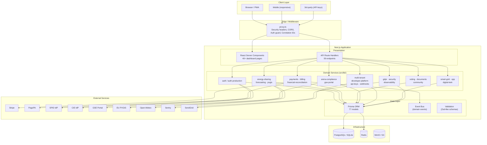
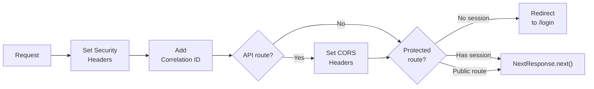
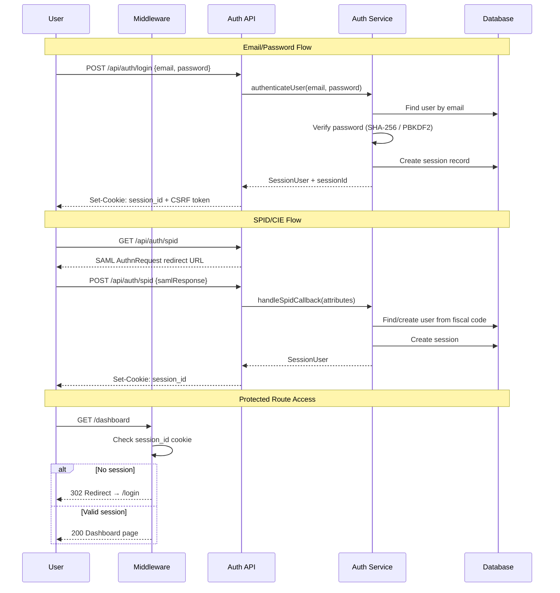
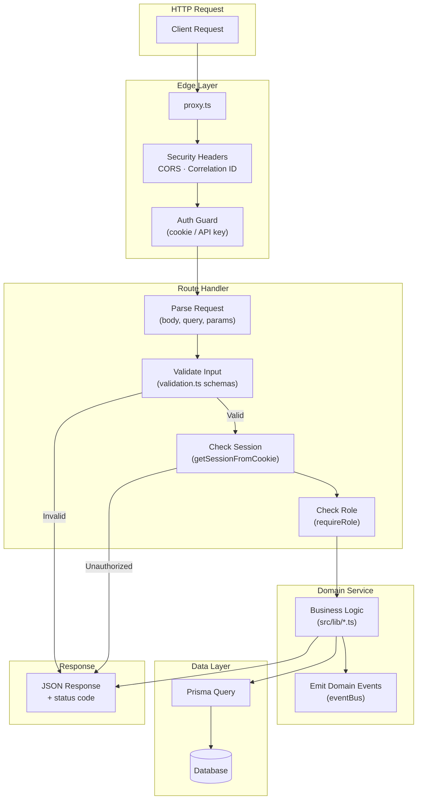
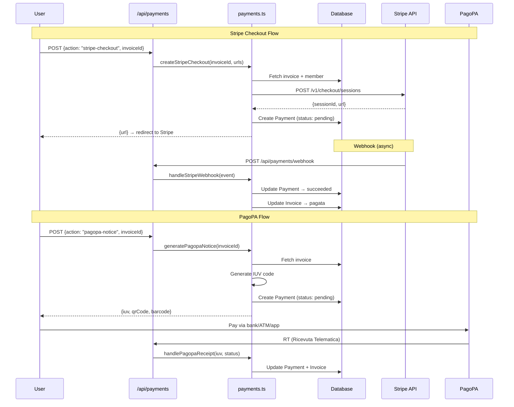
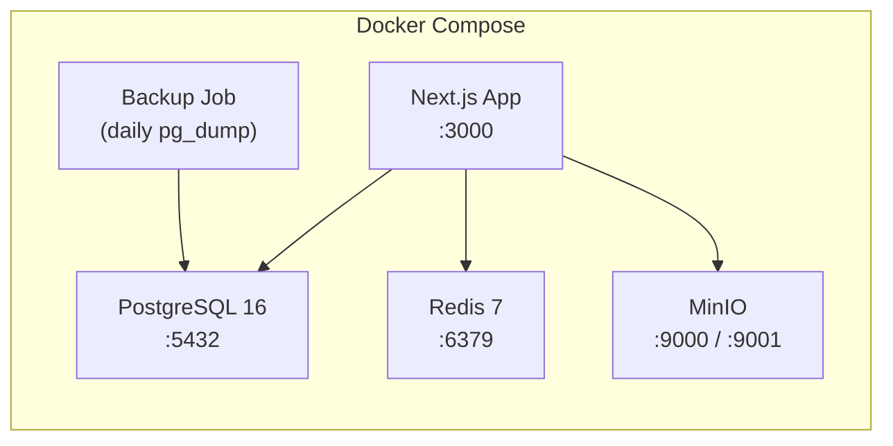
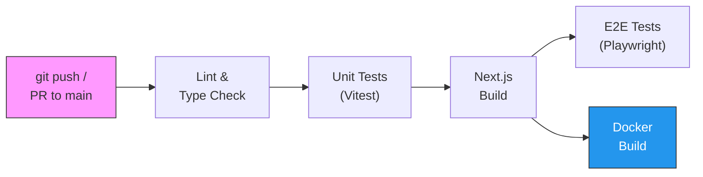

# Architecture Overview

> EnergiaNostra — System architecture, data flow, and design decisions.

## Table of Contents

- [System Overview](#system-overview)
- [Technology Stack](#technology-stack)
- [Application Layers](#application-layers)
- [Data Model](#data-model)
- [Authentication](#authentication)
- [Request Flow](#request-flow)
- [Domain Modules](#domain-modules)
- [Payment Processing](#payment-processing)
- [Infrastructure](#infrastructure)
- [Observability](#observability)
- [Security](#security)
- [Design Decisions](#design-decisions)

---

## System Overview

EnergiaNostra is a Next.js 16 monolith that follows a **modular monolith** pattern. Domain logic is isolated in `src/lib/` service modules, API routes in `src/app/api/` act as thin controllers, and the Prisma ORM provides the persistence layer.



## Technology Stack

| Layer | Technology | Purpose |
|---|---|---|
| **Runtime** | Node.js 20 (Alpine) | Server runtime |
| **Framework** | Next.js 16 (App Router) | Full-stack React framework |
| **Language** | TypeScript 5.x (strict) | Type safety |
| **ORM** | Prisma 7.8 + libSQL adapter | Database access |
| **Database** | SQLite (dev) / PostgreSQL 16 (prod) | Persistence |
| **Cache** | Redis 7 | Sessions, pub/sub, rate limiting |
| **Object Storage** | MinIO / S3 | Document & file storage |
| **Styling** | Tailwind CSS 4 | Utility-first CSS |
| **Charts** | Recharts | Dashboard visualizations |
| **Testing** | Vitest + Testing Library | Unit/integration tests |
| **E2E Testing** | Playwright | Browser automation |
| **CI/CD** | GitHub Actions | Automated pipeline |
| **Containers** | Docker + Docker Compose | Containerization |
| **Orchestration** | Helm (Kubernetes) | Production deployment |
| **IaC** | Terraform (Hetzner Cloud) | Infrastructure provisioning |

## Application Layers

### 1. Edge Middleware (`src/proxy.ts`)

The middleware intercepts all matched requests before they reach route handlers:



**Route protection rules:**
- `/dashboard/*`, `/portale/*`, `/admin/*` — require session cookie
- `/login`, `/registrazione` — redirect to dashboard if already authenticated
- `/api/*` (non-public) — require session cookie or Bearer API key
- Public API routes: `/api/auth/*`, `/api/health`, `/api/openapi`, `/api/status`, `/api/trial/signup`

### 2. API Route Handlers (`src/app/api/`)

59 route files organized by domain. Each follows a consistent pattern:

```typescript
// Typical API route pattern
export async function GET(request: Request) {
  const session = await getSessionFromCookie();
  if (!session) return Response.json({ error: "..." }, { status: 401 });

  const data = await domainService.getData(session.user.cerId);
  return Response.json(data);
}

export async function POST(request: Request) {
  const body = await request.json();
  const validation = validateBody(schemas.mySchema, body);
  if (!validation.success) return validationErrorResponse(validation.errors);

  const result = await domainService.doAction(body);
  return Response.json(result, { status: 201 });
}
```

### 3. Domain Services (`src/lib/`)

54 TypeScript modules containing all business logic. No framework coupling — these are pure service modules that can be tested independently.

### 4. Data Layer (Prisma)

The Prisma client is instantiated as a singleton with the libSQL adapter for SQLite development and PostgreSQL in production. Hot-reload safety is ensured via `globalThis` caching.

## Data Model

77 Prisma models organized into domain aggregates:

```mermaid
erDiagram
    Cer ||--o{ Member : "has members"
    Cer ||--o{ User : "has users"
    Cer ||--o{ EnergyReading : "tracks energy"
    Cer ||--o{ Document : "stores documents"
    Cer ||--o{ Vote : "holds votes"
    Cer ||--o{ Invoice : "generates invoices"
    Cer ||--o{ GseReport : "files GSE reports"
    Cer ||--o{ Announcement : "publishes"

    Member ||--o{ MeterReading : "has readings"
    Member ||--o{ IncentiveShare : "receives incentives"
    Member ||--o{ Invoice : "billed via"

    User ||--o{ Session : "has sessions"
    User ||--o{ BallotCast : "casts votes"
    User ||--o{ Notification : "receives"
    User ||--o{ Payment : "makes payments"
    User ||--o{ StorageObject : "uploads files"

    Vote ||--o{ BallotCast : "receives ballots"
    Invoice ||--o{ Payment : "paid via"
    MeterUpload ||--o{ MeterReading : "contains"

    EnergyOffer ||--o{ TradeMatch : "matched to"
    SmartDevice ||--o{ DeviceTelemetry : "reports"
    SmartDevice ||--o{ DeviceCommand : "receives"
    SmartDevice ||--o{ ChargingSession : "hosts"

    CarbonCredit ||--o{ CarbonTransaction : "traded via"
    Achievement ||--o{ MemberAchievement : "awarded as"
    Challenge ||--o{ ChallengeParticipant : "joined by"

    Tenant ||--o{ TenantUsage : "tracks"
    Tenant ||--o{ TenantInvitation : "invites"
    OAuthApp ||--o{ OAuthAuthorization : "authorizes"
    MarketplacePlugin ||--o{ PluginInstallation : "installed as"
```



### Core Aggregates

| Aggregate | Models | Purpose |
|---|---|---|
| **CER** | `Cer`, `Member`, `EnergyReading`, `MeterReading`, `IncentiveShare` | Community energy management |
| **Auth** | `User`, `Session` | Identity and access |
| **Governance** | `Vote`, `BallotCast`, `Document`, `Announcement` | Democratic decision-making |
| **Finance** | `Invoice`, `Payment`, `PaymentMandate` | Billing and payments |
| **Trading** | `EnergyOffer`, `TradeMatch`, `TradingAccount` | P2P energy market |
| **Smart Grid** | `SmartDevice`, `DeviceTelemetry`, `DeviceCommand`, `ChargingSession`, `DemandResponseEvent` | IoT and grid management |
| **Regulatory** | `GseReport`, `GseSubmission`, `GseReconciliation`, `RegulatoryRule`, `ComplianceDeadline` | GSE/ARERA compliance |
| **Sustainability** | `CarbonCredit`, `CarbonTransaction` | Carbon accounting |
| **Gamification** | `Achievement`, `MemberAchievement`, `Challenge`, `ChallengeParticipant` | Engagement |
| **Platform** | `Tenant`, `ApiKey`, `WebhookSubscription`, `OAuthApp`, `MarketplacePlugin` | Multi-tenant SaaS |
| **GDPR** | Consent records, data export, erasure (managed via service layer) | Privacy compliance |
| **Observability** | `HealthMetric`, `DomainEvent`, `AuditLog` | Monitoring and audit |

## Authentication



### Dual Auth Implementation

| Feature | Demo (`auth.ts`) | Production (`auth-production.ts`) |
|---|---|---|
| Password hashing | SHA-256 + static salt | PBKDF2 (100k iterations) |
| Session storage | In-memory `Map` | Database (`Session` model) |
| Session duration | 7 days | 24h + refresh tokens |
| Rate limiting | None | Sliding window (10 req/min) |
| CSRF | None | Token-based validation |
| SPID/CIE | N/A | Full SAML 2.0 flow |
| Audit logging | None | Auth events logged to DB |

### Roles

| Role | Scope | Capabilities |
|---|---|---|
| `superadmin` | Platform-wide | Tenant management, platform stats |
| `admin` | Per-CER | Full CER management, member CRUD, GSE reports |
| `member` | Per-CER | View energy data, vote, manage own profile |
| `auditor` | Per-CER | Read-only access to all CER data |

## Request Flow



## Domain Modules

The `src/lib/` directory contains 54 domain service modules. Each is a standalone TypeScript module exporting functions and types — no classes with side effects, no framework coupling.

### Module Catalog

| Module | Key Exports | External APIs |
|---|---|---|
| `auth.ts` | `authenticateUser`, `registerUser`, `getSessionFromCookie` | — |
| `auth-production.ts` | `authenticateUserDb`, `handleSpidCallback`, `handleCieCallback` | SPID/CIE IdPs |
| `payments.ts` | `createStripeCheckout`, `generatePagopaNotice`, `createSepaMandate` | Stripe, PagoPA |
| `billing.ts` | `getAllInvoices`, `getBillingStats`, `generateInvoicesForPeriod` | — |
| `trading.ts` | `createOffer`, `acceptOffer`, `getTradingStats` | — |
| `energy-sharing.ts` | Energy sharing calculations per GSE algorithm | — |
| `forecasting.ts` | `fetchWeatherForecast`, `generateForecasts` | Open-Meteo |
| `pvgis.ts` | `fetchPvgisData`, `geocodeAddress` | EU PVGIS |
| `gdpr.ts` | `exportUserData`, `eraseUserData`, `getConsents`, `setConsent` | — |
| `documents.ts` | `generateDocument`, `requestSignatures`, `verifyAndSign` | — |
| `voting.ts` | `createVote`, `castBallot`, `getVoteResults` | — |
| `community.ts` | `createPost`, `getFeed`, `sendMessage`, `createReferral` | — |
| `smart-grid.ts` | `registerDevice`, `recordTelemetry`, `sendCommand`, `createDrEvent` | — |
| `carbon-credits.ts` | `calculateCo2Avoidance`, `issueCredits`, `purchaseCredits` | — |
| `gamification.ts` | `getLeaderboard`, `joinChallenge`, `generateNudges` | — |
| `arera-compliance.ts` | `getRules`, `getUpcomingDeadlines`, `analyzeRegulatoryImpact` | — |
| `gse-portal.ts` | `submitToGse`, `reconcileWithGse` | GSE Portal |
| `notifications.ts` | `createNotification`, `sendEmail`, `subscribePush` | SendGrid, Web Push |
| `storage.ts` | `generateUploadUrl`, `generateDownloadUrl`, `listFiles` | MinIO/S3 |
| `multi-tenant.ts` | `provisionTenant`, `setTenantContext`, `getPlatformStats` | — |
| `developer-platform.ts` | `registerOAuthApp`, `publishPlugin`, `exchangeCodeForToken` | — |
| `ai-optimization.ts` | `trainOptimizationModel`, `generateDailyRecommendations` | — |
| `financial-reconciliation.ts` | `importBankTransactions`, `generateCertificazioneUnica` | — |
| `i18n.ts` | `t`, `getTranslations`, `getCountryConfigs` | — |
| `security.ts` | `checkRateLimit`, `getSecurityHeaders`, `sanitizeHtml`, `getCorsHeaders` | — |
| `validation.ts` | `string`, `number`, `object`, `schemas`, `validateBody` | — |
| `observability.ts` | `logger`, `logRequest`, `captureError`, `withTiming` | Sentry |
| `integrations.ts` | `withCircuitBreaker`, `withRetry`, `getAllIntegrationHealth` | Multiple |
| `db.ts` | `InMemoryStore` | — |
| `prisma.ts` | `prisma` (singleton client) | — |

## Payment Processing



### Supported Payment Methods

| Method | Provider | Use Case |
|---|---|---|
| Credit/Debit Card | Stripe | One-time invoice payments |
| SEPA Direct Debit | Stripe | Recurring member billing |
| PagoPA Notice | PagoPA | Italian public payment system |
| Manual | — | Cash/bank transfer reconciliation |

## Infrastructure

### Docker Compose (Development/Staging)



### Kubernetes (Production)

Helm chart with:
- **2–8 replicas** (HPA at 60% CPU)
- **PostgreSQL** with 20Gi persistent storage
- **Redis** standalone instance
- **Nginx Ingress** with Let's Encrypt TLS
- **Secrets** via Kubernetes Secrets for Stripe, SendGrid, Sentry keys
- **Health checks** on `/api/health`

### Hetzner Cloud (Terraform)

- **Server**: `cx22` (staging) / `cx32` (production) in `nbg1` (Nuremberg — closest to Italy)
- **Network**: Private VPC `10.0.0.0/16` with app subnet `10.0.1.0/24`
- **Firewall**: Ports 22, 80, 443 only
- **Storage**: 20GB attached volume for database

### CI/CD Pipeline



Nightly cron runs E2E tests against staging.

## Observability

### Structured Logging

Pino-compatible JSON logs with correlation IDs:

```json
{
  "level": "info",
  "msg": "Request completed",
  "timestamp": "2025-01-15T10:30:00.000Z",
  "service": "energia-nostra",
  "version": "3.0.0",
  "traceId": "abc123...",
  "route": "/api/energy",
  "method": "GET",
  "statusCode": 200,
  "latencyMs": 42
}
```

### Health Dashboard

`/api/health` returns:

```json
{
  "status": "healthy",
  "database": "connected",
  "timestamp": "...",
  "version": "3.0.0",
  "uptime": 86400,
  "memory": { "heapUsed": "..." },
  "services": { "redis": "up", "minio": "up" }
}
```

### Error Tracking

Errors are captured via `captureError()` and forwarded to Sentry (when `SENTRY_DSN` is configured). Each error includes trace ID, user context, and route information.

## Security

### Defense in Depth

| Layer | Mechanism |
|---|---|
| **Transport** | HSTS with preload, TLS via Let's Encrypt |
| **Headers** | CSP, X-Frame-Options DENY, X-Content-Type-Options nosniff |
| **Authentication** | Cookie sessions, CSRF tokens, rate limiting |
| **Authorization** | Role-based access control (4 roles) |
| **Input** | Schema validation on all POST/PUT endpoints |
| **Output** | HTML entity encoding, `passwordHash`/`stack` stripping in production |
| **CORS** | Allowlist-based origin check |
| **Rate Limiting** | Sliding window per category (auth: 10/min, API: 100/min, upload: 5/min) |
| **Secrets** | Environment variables, Kubernetes Secrets |

### Input Validation

A custom Zod-like validation library (`validation.ts`) provides schema validation without external dependencies:

```typescript
const schema = object({
  email: string({ email: true }),
  password: string({ min: 8, max: 128 }),
  name: string({ min: 2, max: 100 }),
});

const result = validateBody(schema, requestBody);
if (!result.success) return validationErrorResponse(result.errors);
```

Error messages are in Italian (the primary locale).

## Design Decisions

### Why a Modular Monolith?

CER management is a tightly integrated domain — energy readings affect incentive calculations, which affect invoices, which affect payments, which affect GSE reports. A microservice architecture would add network complexity with minimal benefit. The modular monolith keeps deployment simple while maintaining clean domain boundaries.

### Why Custom Auth Instead of NextAuth?

Italian regulatory requirements (SPID/CIE via SAML 2.0) don't fit well into NextAuth's OAuth-centric model. A custom implementation provides full control over the SAML flow, session management, and audit logging.

### Why Custom Validation Instead of Zod?

The validation library is intentionally minimal (~260 lines) to avoid adding a runtime dependency for a relatively small schema surface. It mirrors Zod's API (`safeParse`, `parse`) for familiarity.

### Dual-Mode Architecture

Many modules operate in **demo mode** (in-memory data, simulated external calls) and **production mode** (database persistence, real API calls). This is controlled via environment variables (`STRIPE_SECRET_KEY`, `SPID_ENTITY_ID`, etc.) and allows the platform to run fully functional without any external service configuration.

### Why SQLite in Development?

SQLite via libSQL provides zero-configuration local development. The Prisma schema is database-agnostic, so switching to PostgreSQL in production requires only changing `DATABASE_URL`. The libSQL adapter also enables future edge deployment scenarios.
