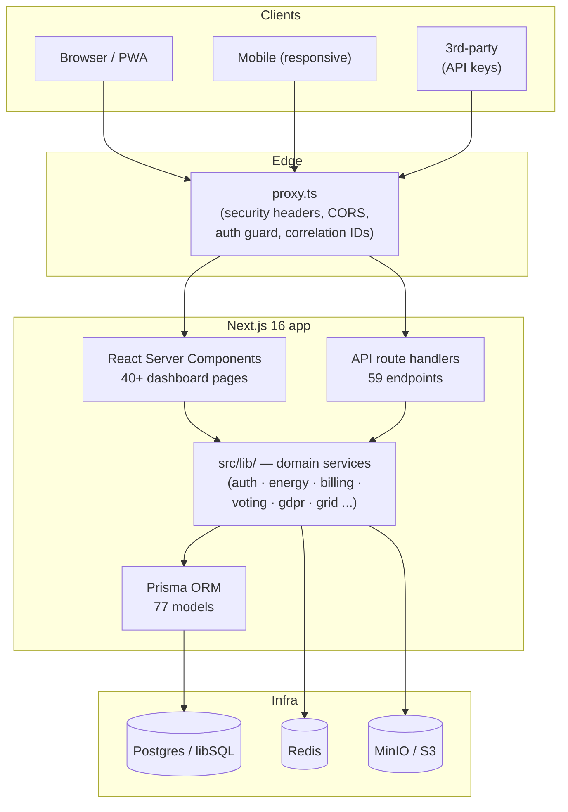
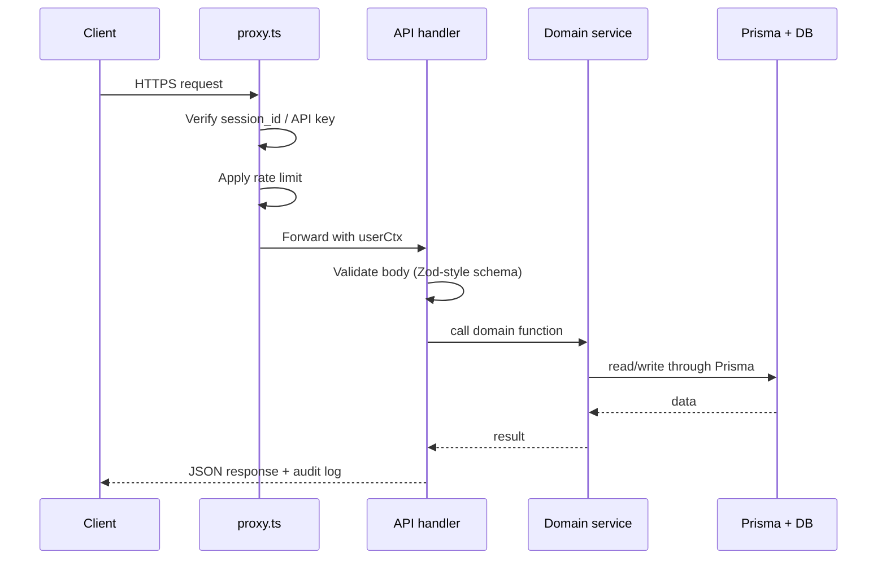
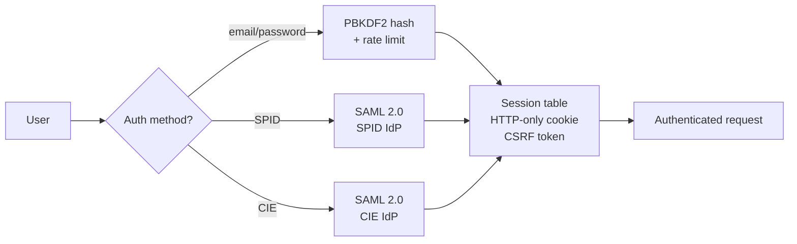

# Architecture

EnergiaNostra is a **modular monolith** built on Next.js 16. One codebase, one
process, one database connection pool — but with strict internal boundaries that
let you split services out later if you need to.

## High-level view

## Four layers, strict direction

1. **Edge (`src/proxy.ts`)** — the Next.js middleware. Applies security headers,
   CORS, CSRF checks, rate limiting and correlation IDs. Never touches the DB.
2. **Presentation (`src/app/`)** — React Server Components for pages, REST handlers
   for `api/`. Handlers parse and validate input, then delegate to domain services.
3. **Domain (`src/lib/`)** — 54 service modules, one per bounded context. This is
   where business rules live. **Domain modules never import each other directly**
   — they communicate through the in-process event bus when they must.
4. **Persistence (`prisma/schema.prisma` + `src/lib/prisma.ts`)** — the single
   Prisma client, 77 models. Domain services own their tables.

## Why a modular monolith

- **A CER is one transaction**: distributing an incentive touches members, meters,
  invoices and payouts atomically. Splitting these into microservices would force
  saga patterns for no benefit.
- **One database, one deploy, one set of migrations** — simpler operations for the
  size of team most CERs can afford.
- **You can still split later**: every domain module is independently testable
  and could become a worker or service if traffic justifies it.

## Request flow

Every request gets a **correlation ID** that flows through logs, the audit table,
and outbound webhooks. You can grep one ID and see the entire trail.

## Domain modules at a glance

| Module file | Responsibility |
|---|---|
| `auth.ts` / `auth-production.ts` | Email/password, SPID, CIE, sessions, CSRF |
| `meter-pipeline.ts` | CSV/XML ingestion, deduplication, quarantine |
| `energy-sharing` (in `data-db.ts`) | GSE-TIAD sharing computation |
| `pvgis.ts` | EU PVGIS yield estimates |
| `forecasting.ts` | Weather-based production forecast |
| `billing.ts` | Invoices, payouts, distribution rules |
| `payments.ts` | Stripe, PagoPA, SEPA |
| `voting.ts` (in `community.ts`) | Polls, quorum, ballots |
| `documents.ts` | PDF generation, e-signatures, S3 storage |
| `gse-portal.ts` / `gse-reporting.ts` | GSE submission and periodic reports |
| `arera-compliance.ts` | ARERA regulatory rule checks |
| `gdpr.ts` | Consent ledger, exports, erasure |
| `smart-grid.ts` | IoT, OCPP EV charging, demand response |
| `trading.ts` | P2P energy trading marketplace |
| `multi-tenant.ts` | Tenant isolation for multi-CER deployments |
| `developer-platform.ts` / `api-platform.ts` | OAuth2 apps, API keys, webhooks |

See [Data model](./data-model) for how these map to tables.

## Authentication architecture

Sessions are server-side rows in the `Session` table — not JWTs — so we can revoke
them instantly and audit every login. See [Authentication](./authentication).

## Storage

- **Relational data**: PostgreSQL in production, libSQL/SQLite in development. The
  Prisma schema is the same.
- **Files**: S3-compatible (MinIO locally, AWS S3 or Hetzner Object Storage in
  production). Used for bylaws, signed PDFs, meter export archives.
- **Cache & queues**: Redis. Used for rate limiting, session lookups (hot path),
  and a lightweight job queue for outbound webhooks.

## Observability

- Structured JSON logs with correlation IDs (`src/lib/observability.ts`).
- Prometheus-style `/api/metrics` endpoint.
- Optional Sentry integration via `SENTRY_DSN`.
- Per-request audit rows for every state-changing endpoint.

## Deployment topologies

| Scenario | Recommended setup |
|---|---|
| Pilot, single CER | Single Hetzner CX22 + managed Postgres. Docker Compose. |
| 10–50 CERs | Kubernetes (Helm chart provided), 2× app replicas, managed Postgres + Redis. |
| Multi-tenant SaaS | Same Helm chart with `MULTI_TENANT=true` and per-tenant DB schema. |

See [Guides → Deploy to production](../guides/deploy-production) for the concrete
recipes.
