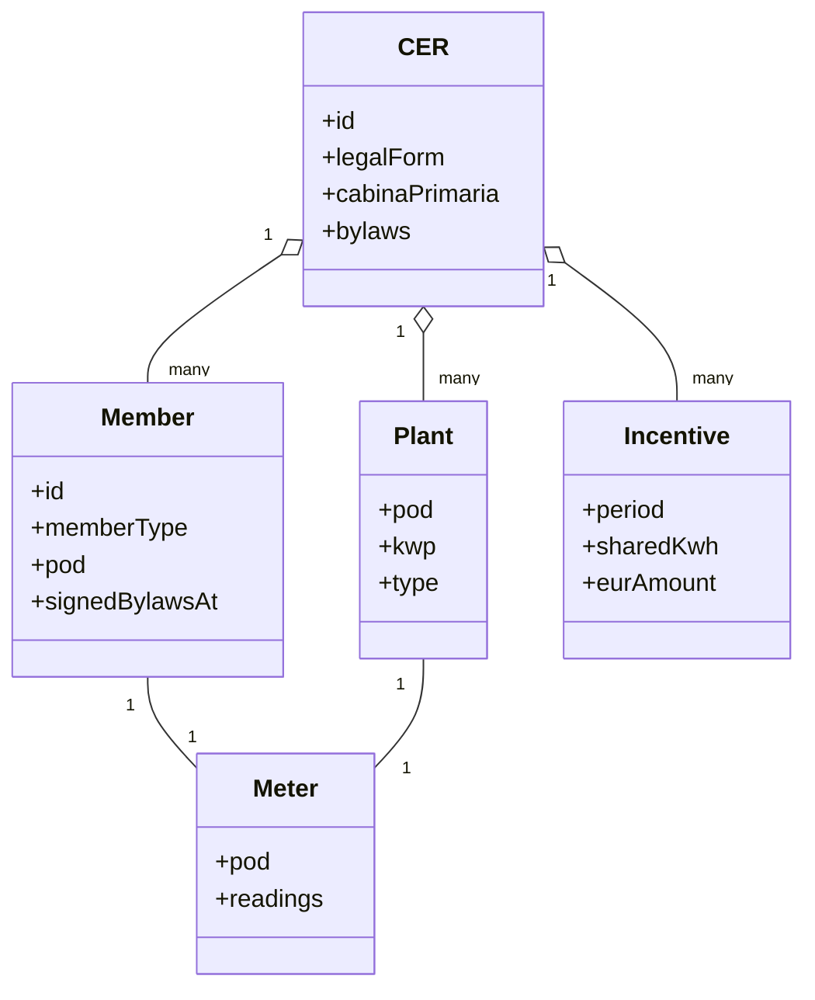
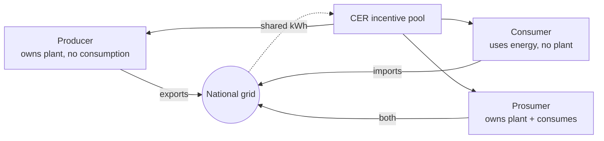
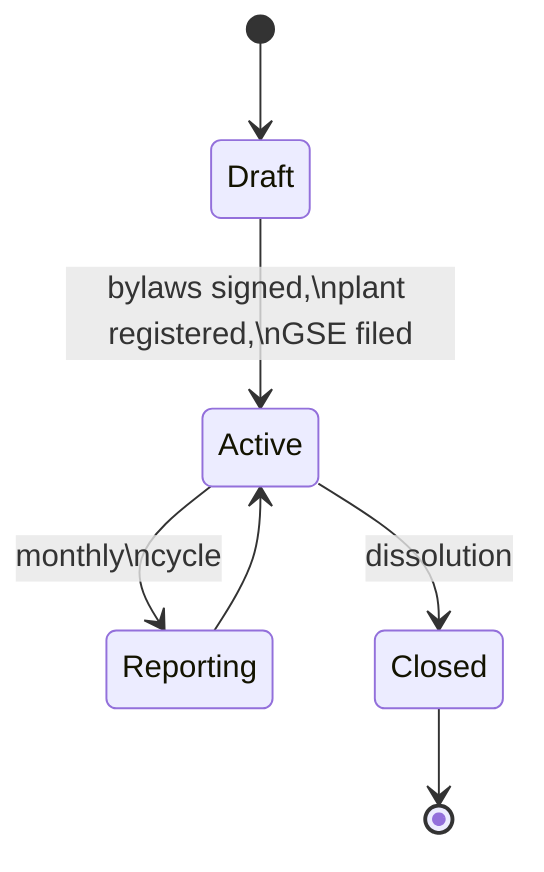

# What is a CER?

A **Comunità Energetica Rinnovabile (CER)** is a legal entity — usually a no-profit
association or cooperative — whose members **produce, share and consume renewable
energy locally**, under the framework introduced by Italian Decree D.Lgs. 199/2021
(transposing EU Directive RED II 2018/2001).

Understanding the CER model is essential because EnergiaNostra's data model and
API mirror it directly.

## The five entities

| Entity | What it is |
|---|---|
| **CER** | The legal entity (association, cooperative, or SRL). |
| **Member** | A natural or legal person enrolled in the CER. Three sub-types: **consumer**, **producer**, **prosumer**. |
| **Plant** | A renewable production plant (PV, micro-wind, micro-hydro). Has a POD code. |
| **Meter** | A POD's smart-meter readings — usually 15-minute granularity. |
| **Incentive** | The GSE payout for shared energy in a given month. |

## The cabina primaria perimeter

Italian law restricts a CER's members to those served by the **same primary
electrical substation (cabina primaria)**. There are ~2,100 cabine primarie in
Italy; each covers a few thousand POD codes.

This is the single most common reason a member can't join a CER. EnergiaNostra
checks the constraint at three moments:

1. **Invitation**: the inviter must specify a POD; we look up its cabina primaria
   from the e-distribuzione lookup table.
2. **Onboarding**: the new member confirms their POD; we re-validate.
3. **Activation**: when the CER goes live, the full member list is re-checked.

## Member types and what they get

- **Consumers** earn a share of the GSE incentive because their consumption
  *makes the shared kWh possible*. They also typically save on retail energy costs.
- **Producers** earn the incentive plus the wholesale energy price for the kWh
  they export.
- **Prosumers** sit in the middle: they self-consume first, then contribute the
  rest to the community.

The CER's bylaws decide the **distribution rule** (pro-rata-shared, equal split,
weighted by membership stake, …). EnergiaNostra implements the common rules
out-of-the-box; custom rules are a few lines of TypeScript in
`src/lib/billing.ts`.

## What the GSE actually pays

The current tariff (May 2025) is **€110/MWh** of shared energy, on top of:

- Normal energy savings (consumers pay less to their retailer for self-consumed kWh).
- A **PNRR grant** of up to **40% of plant CAPEX** for CERs in municipalities under
  5,000 inhabitants.

EnergiaNostra computes all three and shows them in the **Dashboard → Finance →
Forecast** view, so members understand their projected annual return before they
sign anything.

## The legal lifecycle

- **Draft** — the legal entity exists but the GSE registration is pending. No
  incentive accrues.
- **Active** — GSE-approved. Meter data is ingested monthly; incentives are
  calculated and distributed.
- **Reporting** — the platform produces an annual **bilancio** (financial report)
  and assembly minutes.
- **Closed** — dissolution following the bylaws.

## Where EnergiaNostra fits

| You handle | EnergiaNostra handles |
|---|---|
| Forming the legal entity (notaio for cooperatives) | Bylaws template, e-signature, document storage |
| Installing the PV plant | POD lookup, PVGIS yield estimate, ongoing metering |
| Member acquisition | Invitations, SPID/CIE onboarding, member portal |
| Decisions (board, assembly) | Digital voting, quorum, minutes |
| Filing taxes and Certificazione Unica | All the underlying numbers and exports |

## Further reading

- [Architecture](./architecture) — how this maps to code.
- [Data model](./data-model) — the 77 Prisma models that back the entities above.
- [Energy sharing](./energy-sharing) — the actual maths of the GSE-TIAD method.
