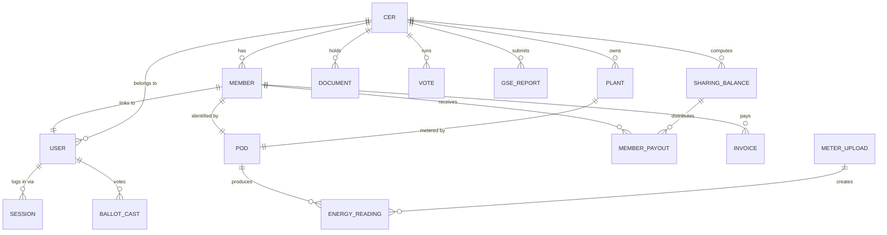
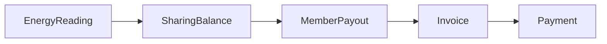

# Data model

EnergiaNostra defines **77 Prisma models** in `prisma/schema.prisma`. They are
grouped into ten domain areas. This page is the **mental map** — for column-level
detail, read the schema file directly; for entity relationships, see the diagrams
below.

## Domain groups

| Group | Representative models | Purpose |
|---|---|---|
| **Identity** | `User`, `Session`, `ApiKey`, `OAuthClient` | Auth and access |
| **CER** | `Cer`, `Member`, `Plant`, `CerInvitation` | Community structure |
| **Energy** | `EnergyReading`, `MeterUpload`, `ImportJob`, `SharingBalance` | Meter data + sharing |
| **Forecasting** | `WeatherSnapshot`, `ProductionForecast`, `OptimisationHint` | Predictions |
| **Finance** | `Invoice`, `Payment`, `MemberPayout`, `Tariff` | Money flow |
| **Governance** | `Vote`, `Ballot`, `BallotCast`, `Document`, `Announcement` | Decisions + records |
| **Regulatory** | `GseReport`, `GseSubmission`, `AreraCheck`, `PnrrGrant` | Compliance |
| **Smart grid** | `IotDevice`, `EvCharger`, `DemandResponseEvent`, `VppGroup` | Hardware |
| **Sustainability** | `CarbonCredit`, `CarbonLedgerEntry`, `Challenge` | CO₂ + gamification |
| **Platform** | `Tenant`, `Webhook`, `AuditEvent`, `NotificationPreference` | Cross-cutting |

## Core entity relationships



## Identity

`User` is the universal account. `Member` is a *role within a CER* and points to a
`User`. A `User` can be a member of one CER and an admin of another; the `cerId`
column on `User` is just a default tenant for convenience.

`Session` rows live server-side. We never use JWTs for the web app — sessions are
revocable in O(1) by deleting the row. API keys (`ApiKey`) are separate and have
their own rate-limit buckets.

## CER & members

| Field on `Cer` | Why it matters |
|---|---|
| `cabinaPrimaria` | The legal perimeter (see [What is a CER?](./cer)). Indexed. |
| `legalForm` | `association` \| `cooperative` \| `srl`. Drives which bylaws template is generated. |
| `status` | `draft` \| `active` \| `reporting` \| `closed`. Drives the state machine. |

| Field on `Member` | Why it matters |
|---|---|
| `memberType` | `consumer` \| `producer` \| `prosumer`. Affects the distribution rule. |
| `pod` | The POD code (Italian electricity point of delivery). Unique per CER. |
| `signedBylawsAt` | Null until e-signature is captured. |
| `entryDate` | Used when payouts are pro-rated by tenure. |

## Energy data

`EnergyReading` is the hot table — one row per (POD, 15-minute interval). At one
year of operation with 50 PODs and 4 readings/hour, this is ~1.75M rows. Postgres
handles it comfortably; we shard by `cerId` when a deployment crosses ~10M rows.

```text
EnergyReading (pod, periodStart, kwhProduced, kwhConsumed, source, uploadId)
  ▲
  │ insert
  │
MeterUpload (id, cerId, period, fileUrl, status, errorCount)
  ▲
  │ batch
  │
ImportJob (queued by API or scheduled cron)
```

Every reading carries the `uploadId` that created it, so an erroneous CSV can be
re-imported deterministically.

## Sharing & finance

`SharingBalance` is the immutable output of an energy-sharing computation for a
(CER, period). Computing it twice with the same input always produces the same
hash. From it, `MemberPayout` rows are derived; then `Invoice` and `Payment` rows
materialise the money flow.



## Governance

`Vote` is a poll. `Ballot` is an option. `BallotCast` is a user's vote, signed
with the user's `csrfToken` and a server-generated nonce so the same ballot can be
verified later. We store quorum settings on the `Vote` and refuse to close it
until they're met.

## Regulatory

`GseReport` and `GseSubmission` track interactions with the GSE portal.
`AreraCheck` runs a set of rules (renewable share, perimeter compliance, …) and
stores results; the dashboard exposes them as a checklist.

## Looking at the schema yourself

```bash
# Open the schema in your editor
$EDITOR prisma/schema.prisma

# Generate a visual diagram (requires prisma-erd-generator)
npx prisma generate
```

For an authoritative answer to "which column drives X?" always read the schema.
This page is the map; the schema is the territory.
