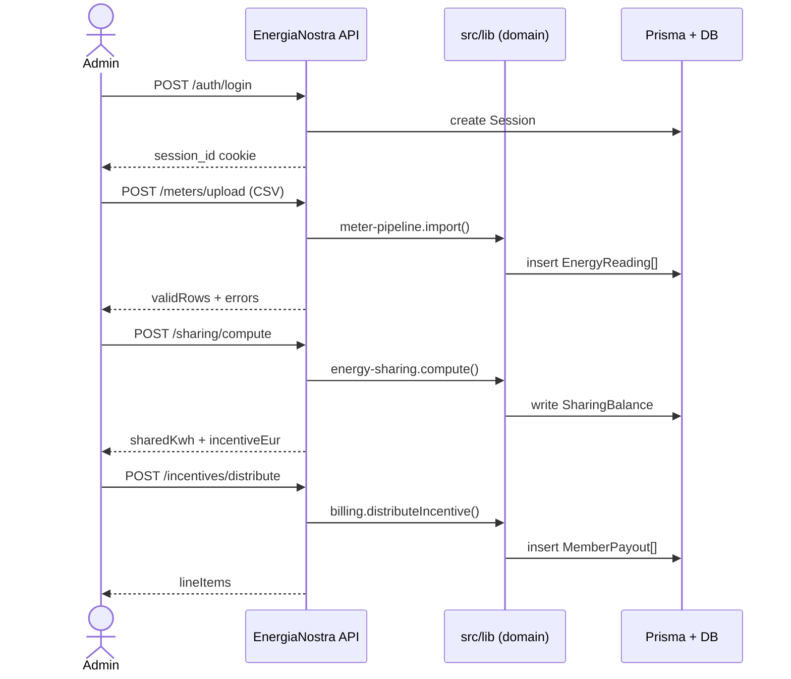

# Quickstart

This guide walks the **happy path** of a CER's monthly cycle in four API calls:

1. Authenticate.
2. Upload meter data.
3. Compute the energy-sharing balance.
4. Distribute the GSE incentive to members.

Prerequisites: a running EnergiaNostra dev server ([Installation](./installation))
and a terminal with `curl` and `jq`.

## 1. Authenticate

```bash
curl -c cookies.txt -X POST http://localhost:3000/api/auth/login \
  -H 'Content-Type: application/json' \
  -d '{"email":"admin@energianostra.it","password":"demo2025"}'
```

The response sets a `session_id` HTTP-only cookie in `cookies.txt`. You'll reuse
this file for every subsequent call.

```json
{
  "user": {
    "id": "user-admin-1",
    "email": "admin@energianostra.it",
    "role": "admin",
    "cerId": "cer-bertinoro"
  }
}
```

:::tip Use an API key in production
For server-to-server integrations, generate an API key from
**Dashboard → Developers → API Keys** and pass it as
`Authorization: Bearer en_live_...`. See [API reference → Authentication](../reference/api#authentication).
:::

## 2. Upload meter data

Smart-meter exports arrive as CSV. EnergiaNostra accepts the **GSE-standard**
columns: `pod`, `timestamp_iso`, `kwh_produced`, `kwh_consumed`.

```bash
cat > january.csv <<'CSV'
pod,timestamp_iso,kwh_produced,kwh_consumed
IT001E12345678,2025-01-01T00:00:00Z,0.00,0.42
IT001E12345678,2025-01-01T00:15:00Z,0.00,0.38
IT001E12345678,2025-01-01T12:00:00Z,1.85,0.21
CSV

curl -b cookies.txt -X POST http://localhost:3000/api/meters/upload \
  -F "cerId=cer-bertinoro" \
  -F "period=2025-01" \
  -F "file=@january.csv"
```

Response:

```json
{
  "uploadId": "upload-3f4a",
  "rows": 8640,
  "validRows": 8638,
  "errors": [
    { "row": 4203, "reason": "kwh_produced negative" },
    { "row": 7711, "reason": "duplicate (pod, timestamp)" }
  ],
  "status": "imported"
}
```

The two rejected rows are quarantined, never silently discarded. The full list is
viewable at `Dashboard → Meters → Imports → upload-3f4a`.

## 3. Compute the energy-sharing balance

Energy sharing is the heart of a CER: how much locally-produced energy was consumed
by community members **in the same hour**. That amount qualifies for the GSE
incentive.

```bash
curl -b cookies.txt -X POST http://localhost:3000/api/cer/cer-bertinoro/sharing/compute \
  -H 'Content-Type: application/json' \
  -d '{"period":"2025-01"}' | jq
```

```json
{
  "cerId": "cer-bertinoro",
  "period": "2025-01",
  "totalProducedKwh": 4820.5,
  "totalConsumedKwh": 9112.3,
  "sharedKwh": 3214.7,
  "selfConsumedKwh": 612.1,
  "exportedKwh": 993.7,
  "incentiveEur": 353.62,
  "methodology": "GSE-TIAD-2024",
  "computedAt": "2025-02-01T08:14:22Z"
}
```

EnergiaNostra applies the official **GSE TIAD methodology**: for every hour, take
`min(produced_by_cer, consumed_by_cer)`, sum across the month, and multiply by the
current tariff (`€110/MWh` at the time of writing). See
[Concepts → Energy sharing](../concepts/energy-sharing) for the math.

## 4. Distribute the incentive

The €353.62 incentive doesn't go to one wallet — it must be split among members
according to the CER's bylaws. EnergiaNostra reads the **distribution rule** stored
on the CER and emits one line item per member.

```bash
curl -b cookies.txt -X POST http://localhost:3000/api/cer/cer-bertinoro/incentives/distribute \
  -H 'Content-Type: application/json' \
  -d '{"period":"2025-01","rule":"pro-rata-shared"}' | jq
```

```json
{
  "period": "2025-01",
  "rule": "pro-rata-shared",
  "totalEur": 353.62,
  "lineItems": [
    { "memberId": "m-001", "name": "Comune di Bertinoro", "eur": 142.18 },
    { "memberId": "m-002", "name": "Panificio Rossi",     "eur":  88.04 },
    { "memberId": "m-003", "name": "Famiglia Bianchi",    "eur":  41.92 },
    { "memberId": "m-004", "name": "Scuola Materna",      "eur":  37.50 },
    { "memberId": "m-005", "name": "Bar Centrale",        "eur":  23.71 },
    { "memberId": "m-006", "name": "Studio Verdi",        "eur":  20.27 }
  ]
}
```

Each line item is now a `MemberPayout` row in the database. The next time you run
`POST /api/billing/run`, those payouts become bank transfers (SEPA) or PagoPA
notices, depending on each member's payment preference.

## What just happened

In four calls you exercised the full vertical:



## Next steps

- [Your first CER](./your-first-cer) — create a CER from scratch instead of using
  the seeded one.
- [Guides → Upload meter data](../guides/upload-meter-data) — robust ingestion
  patterns (XML, e-distribuzione API, scheduled imports).
- [Reference → API](../reference/api) — every endpoint, every payload.
