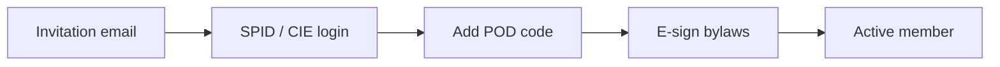

# Your first CER

This guide creates a brand-new CER without the seed data, so you understand every
moving part. By the end you'll have:

- A `Cer` record bound to a municipality and **cabina primaria**.
- Three members with verified POD codes.
- A signed digital bylaw (statuto).
- One administrator who can log in with SPID or email/password.

If you only want to play with the demo data, skip to
[Concepts → CER](../concepts/cer).

## 1. Create the legal entity

A CER is a legal entity (association, cooperative, or SRL) that owns one or more
production plants. Create it with one POST:

```bash
curl -b cookies.txt -X POST http://localhost:3000/api/cer \
  -H 'Content-Type: application/json' \
  -d '{
    "name": "CER Vallecchio",
    "legalForm": "association",
    "municipality": "Vallecchio",
    "province": "FC",
    "cabinaPrimaria": "CP-FC-014",
    "vatNumber": "04123450407",
    "foundedYear": 2025
  }'
```

```json
{
  "id": "cer-vallecchio",
  "status": "draft",
  "nextSteps": ["upload-statuto", "register-plant", "invite-members"]
}
```

:::info Why `cabinaPrimaria` matters
GSE rules require all members of a CER to be served by the **same primary
substation (cabina primaria)**. EnergiaNostra validates this at member-add time —
you cannot accidentally enrol someone outside the perimeter.
:::

## 2. Register the production plant

Most CERs start with a single PV plant on a public roof. Register it so the meter
readings can be attributed correctly:

```bash
curl -b cookies.txt -X POST http://localhost:3000/api/cer/cer-vallecchio/plants \
  -H 'Content-Type: application/json' \
  -d '{
    "pod": "IT001E99887766",
    "type": "photovoltaic",
    "kwp": 49.5,
    "installedOn": "2024-09-12",
    "address": "Via Roma 1, Vallecchio FC"
  }'
```

EnergiaNostra calls **EU PVGIS** with the plant address to estimate annual yield
and stores it on the plant record. You'll see this number in
`Dashboard → Plants → IT001E99887766`.

## 3. Upload the bylaws

Every CER needs a *statuto* (bylaws). EnergiaNostra generates a vetted template you
can customise, or you can upload an existing PDF:

```bash
curl -b cookies.txt -X POST http://localhost:3000/api/cer/cer-vallecchio/documents \
  -F "type=statuto" \
  -F "file=@statuto-vallecchio.pdf"
```

The document goes into S3-compatible storage with a SHA-256 fingerprint and is
linked to the CER. Members will be asked to e-sign it at onboarding.

## 4. Invite members

Send invitations by email — each invitation contains a one-time link that walks the
recipient through SPID/CIE login and e-signature of the bylaws:

```bash
curl -b cookies.txt -X POST http://localhost:3000/api/cer/cer-vallecchio/invitations \
  -H 'Content-Type: application/json' \
  -d '{
    "invitations": [
      { "email": "sindaco@vallecchio.fc.it", "role": "admin",  "memberType": "consumer" },
      { "email": "panificio@example.it",      "role": "member", "memberType": "prosumer" },
      { "email": "scuola@vallecchio.fc.it",   "role": "member", "memberType": "consumer" }
    ]
  }'
```

Each invitee receives an email with a link like
`https://your-host/onboarding?token=...`. The flow:



A member becomes **active** only after all four steps complete. Until then, their
POD is not included in energy-sharing calculations.

## 5. Activate the CER

When you have at least one plant, signed bylaws, and one admin member, the CER can
transition out of `draft`:

```bash
curl -b cookies.txt -X POST http://localhost:3000/api/cer/cer-vallecchio/activate
```

```json
{
  "id": "cer-vallecchio",
  "status": "active",
  "activatedAt": "2025-05-18T09:14:00Z",
  "gseRegistration": "pending"
}
```

The `gseRegistration: pending` field means EnergiaNostra has queued the GSE portal
application. Track its progress at **Dashboard → Compliance → GSE**, or with
`GET /api/cer/cer-vallecchio/gse/status`.

## Cross-check

Verify everything by reading the CER back:

```bash
curl -b cookies.txt http://localhost:3000/api/cer/cer-vallecchio | jq
```

You should see `status: "active"`, `members.length >= 1`, `plants.length >= 1`,
and a `documents` array containing the signed bylaws.

## Next steps

- [Concepts → CER](../concepts/cer) — the legal and technical model behind these
  endpoints.
- [Guides → Onboard members at scale](../guides/onboard-members) — bulk imports,
  CSV templates, SPID edge cases.
- [Guides → GSE reporting](../guides/gse-reporting) — what happens once the GSE
  registration is approved.
