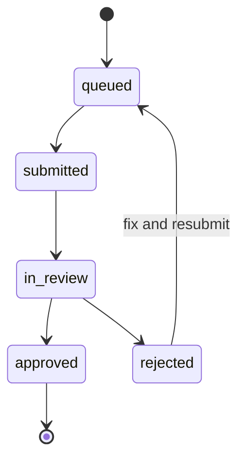

# GSE reporting

The Gestore Servizi Energetici (GSE) is the public body that pays the CER
incentive. To receive money, your CER must:

1. Be **registered** in the GSE portal (one-off).
2. Submit **monthly meter data** (or have GSE pull it from e-distribuzione).
3. Provide **annual compliance reports** (financial statement, member list,
   plant updates).

EnergiaNostra automates all three.

## 1. Initial GSE registration

After [activating a CER](../getting-started/your-first-cer#5-activate-the-cer)
the registration is queued. Track it:

```bash
curl -b cookies.txt http://localhost:3000/api/cer/cer-bertinoro/gse/status | jq
```

```json
{
  "registration": {
    "status": "in_review",
    "submittedAt": "2025-05-18T10:00:00Z",
    "gseReference": "CER-2025-00472",
    "expectedDecisionBy": "2025-07-18"
  },
  "missingDocuments": []
}
```

The GSE typically responds within 30–60 days. Status transitions are:



If `status` becomes `rejected`, the response includes a `reasons` array. The most
common rejections are:

- Plant POD does not match the GSE plant registry.
- Bylaws do not include the required ARERA boilerplate.
- The cabina primaria of one member doesn't match the others.

Each reason maps to a remediation action shown in **Dashboard → Compliance →
GSE → Issues**.

## 2. Monthly reporting

Once approved, monthly data submission is automatic. The cron in
`src/lib/gse-reporting.ts` runs on the 5th of each month and submits the previous
month's meter data:

```text
05:00 UTC, day 5 of month
  ├── Ensure all PODs have ≥95% coverage for previous month
  ├── Compute SharingBalance for previous month
  ├── Render GSE XML report
  ├── Submit via GSE portal API
  └── Store GseSubmission row + receipt
```

You can also trigger it manually:

```bash
curl -b cookies.txt -X POST \
  http://localhost:3000/api/cer/cer-bertinoro/gse/report \
  -H 'Content-Type: application/json' \
  -d '{"period":"2025-04"}'
```

```json
{
  "submissionId": "gses-7a1b",
  "period": "2025-04",
  "sharedKwh": 3214.7,
  "incentiveExpectedEur": 353.62,
  "gseReceiptNumber": "REC-2025-04-00472",
  "status": "submitted"
}
```

The receipt is your proof of submission — keep it in your records for 10 years
(ARERA requirement). EnergiaNostra stores it in `Document` automatically.

## 3. Annual compliance

Every year a CER must submit:

- **Bilancio** (financial statement) — generated from `Invoice` + `Payment`.
- **Member registry** — current `Member` list with entry/exit dates.
- **Plant updates** — any maintenance, upgrades, capacity changes.
- **Assembly minutes** — the *verbale* of the year's assemblies.

EnergiaNostra bundles all four:

```bash
curl -b cookies.txt -X POST \
  http://localhost:3000/api/cer/cer-bertinoro/gse/annual-report \
  -H 'Content-Type: application/json' \
  -d '{"year":2024}'
```

```json
{
  "reportId": "gse-annual-2024",
  "documents": [
    { "type": "bilancio",     "url": "..." },
    { "type": "members",      "url": "..." },
    { "type": "plants",       "url": "..." },
    { "type": "assemblies",   "url": "..." }
  ],
  "submittedAt": "2025-04-30T11:23:00Z"
}
```

## Handling rejections

When the GSE rejects a monthly submission (typically for coverage below 95% or
out-of-range values), EnergiaNostra:

1. Marks the `GseSubmission` as `rejected`.
2. Creates an `AreraCheck` with the failure detail.
3. Notifies all admins (email + push).
4. Holds the next monthly payout until the issue is resolved.

You fix the underlying issue (typically re-import the bad CSV — see
[Upload meter data](./upload-meter-data#re-importing)) and resubmit.

## ARERA rule changes

The regulator periodically updates rules — new validation thresholds, new XML
schema, new tariffs. The `src/lib/arera-compliance.ts` module versions every
rule:

```typescript
{ id: "TIAD-2024-v3", validFrom: "2024-09-01", validTo: null, tariff: 0.110 }
```

When ARERA publishes a new version, you bump it and EnergiaNostra applies the new
rule to periods on or after `validFrom`. Historical periods keep their original
rule for replayability.

Subscribe to the platform's `arera.rule_change` webhook to be notified
automatically when a new rule version is loaded.

## Auditor access

Auditors get a read-only role with access to:

- All `Invoice` and `Payment` rows.
- All `GseSubmission` and `GseReport` rows with receipts.
- All `AuditEvent` rows.
- A "freeze view" that locks data to a specific date so the auditor sees the same
  numbers across sessions.

Provision an auditor account from **Settings → Roles → Add auditor**.
