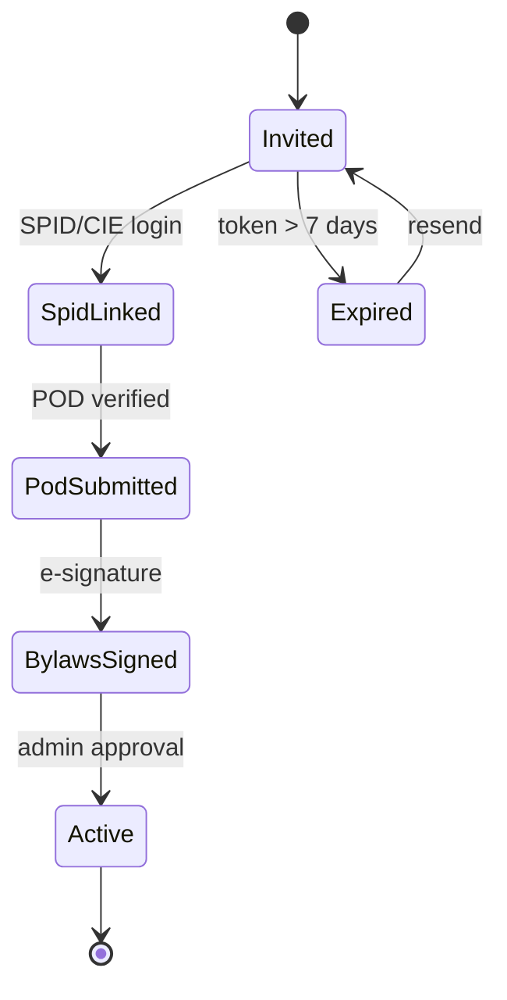

# Onboard members

Adding members is the single most repeated workflow in a CER's life. This guide
covers the three patterns that matter:

1. **Single invitation** from the dashboard.
2. **Bulk CSV import** for launching a new CER.
3. **Self-service signup** via a public link.

## Pattern 1 — Single invitation

From the dashboard: **Members → Invite member**, or via API:

```bash
curl -b cookies.txt -X POST \
  http://localhost:3000/api/cer/cer-bertinoro/invitations \
  -H 'Content-Type: application/json' \
  -d '{
    "invitations": [
      {
        "email": "anna.rossi@example.it",
        "memberType": "prosumer",
        "pod": "IT001E55443322",
        "role": "member"
      }
    ]
  }'
```

The invitee receives an email containing a one-time `?token=...` link valid for
seven days. Re-sending an invitation invalidates the previous token.

## Pattern 2 — Bulk CSV import

For launching, you usually have a spreadsheet of pre-committed members. Save it
as CSV with these columns:

```csv
email,memberType,pod,role,fullName,fiscalCode
anna.rossi@example.it,prosumer,IT001E55443322,member,Anna Rossi,RSSNNA80A41H294K
mario.bianchi@example.it,consumer,IT001E66554433,member,Mario Bianchi,BNCMRA75B12H294X
panificio@example.it,consumer,IT001E77665544,member,Panificio Rossi S.r.l.,04123450407
```

Upload it:

```bash
curl -b cookies.txt -X POST \
  http://localhost:3000/api/cer/cer-bertinoro/invitations/bulk \
  -F "file=@members.csv"
```

Response:

```json
{
  "validRows": 3,
  "errors": [],
  "queued": 3,
  "remindAfterDays": 3
}
```

The platform sends invitations immediately and a **reminder after 3 days** for
anyone who hasn't completed onboarding. You can change the reminder cadence in
**Settings → Onboarding**.

### Common CSV errors

| Error message | Fix |
|---|---|
| `pod: not in cabina primaria CP-FC-014` | Member is outside the CER's perimeter — they cannot legally join. |
| `pod: already enrolled` | Same POD is already a member (possibly inactive). |
| `email: invalid format` | RFC 5322 validation failed. |
| `memberType: must be one of consumer/producer/prosumer` | Typo or stray whitespace. |
| `fiscalCode: invalid checksum` | Italian *codice fiscale* validation failed. |

## Pattern 3 — Self-service signup

For larger CERs (municipalities, condominiums), publish a self-service link:

```bash
curl -b cookies.txt -X POST \
  http://localhost:3000/api/cer/cer-bertinoro/signup-link \
  -H 'Content-Type: application/json' \
  -d '{"expiresInDays": 90, "maxUses": 200}'
```

```json
{
  "url": "https://your-host/onboarding?cer=cer-bertinoro&signup=spx_4f2a...",
  "expiresAt": "2025-08-16T00:00:00Z",
  "usedCount": 0,
  "maxUses": 200
}
```

Self-service users still go through SPID/CIE login, POD validation, and bylaws
e-signature — so you don't lose any safety even though there's no individual
invitation.

## The onboarding state machine



The **admin approval** step exists for compliance: someone with the `admin` role
must confirm membership in the dashboard before energy data starts flowing into
sharing computations. For low-friction CERs you can flip
`AUTO_APPROVE_MEMBERS=true` in env — but most regulators prefer the manual step.

## Edge cases

### A member changes their POD

PODs change when a member moves house or upgrades a meter. Don't create a new
`Member` — use the POD-change endpoint, which preserves payout history:

```bash
curl -b cookies.txt -X PATCH \
  http://localhost:3000/api/cer/cer-bertinoro/members/m-003 \
  -H 'Content-Type: application/json' \
  -d '{
    "newPod": "IT001E99887766",
    "effectiveDate": "2025-05-01"
  }'
```

Sharing computations *after* `effectiveDate` use the new POD; computations
*before* keep using the old one.

### A member leaves the CER

```bash
curl -b cookies.txt -X POST \
  http://localhost:3000/api/cer/cer-bertinoro/members/m-003/leave \
  -H 'Content-Type: application/json' \
  -d '{"reason":"moved out of region","effectiveDate":"2025-04-30"}'
```

The member stays in the database (with `status: "left"`) so historical payouts
stay attributable. They no longer receive new payouts and their POD is excluded
from future sharing calculations.

### A condominium with 30 apartments

Treat each apartment as a `Member` if each has its own POD (the legal default in
Italy). If the condominium has a single POD upstream, you have one `Member`
representing the *amministratore di condominio*.

## Verifying your work

After bulk-onboarding, sanity-check from the dashboard or via:

```bash
curl -b cookies.txt http://localhost:3000/api/cer/cer-bertinoro/members?status=active | jq 'length'
```

Run a dry-run of next month's sharing computation to surface missing meter data
before the period closes:

```bash
curl -b cookies.txt -X POST \
  http://localhost:3000/api/cer/cer-bertinoro/sharing/dry-run \
  -H 'Content-Type: application/json' \
  -d '{"period":"2025-05"}'
```
