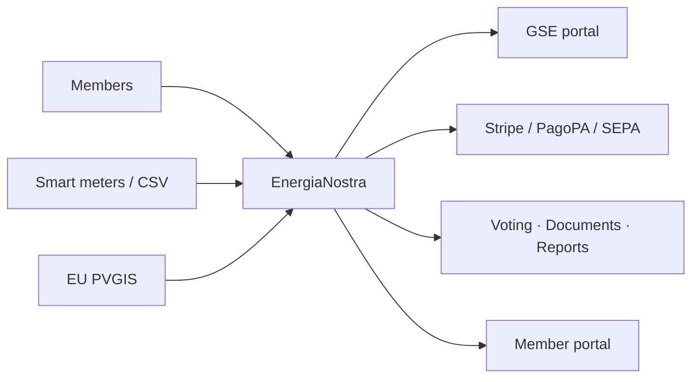

# Welcome to EnergiaNostra

**EnergiaNostra** is an open-source, MIT-licensed platform for creating and running
**Comunità Energetiche Rinnovabili (CER)** — Italian Renewable Energy Communities — under
the D.Lgs. 199/2021 framework and the EU RED II directive.

It is a single Next.js 16 application that covers every part of the CER lifecycle:

- Onboarding members with **SPID** or **CIE** authentication.
- Importing smart-meter data, computing **virtual energy sharing**, and forecasting production.
- Distributing the **GSE incentive** (€110–120/MWh of shared energy) to members.
- Running democratic governance: digital voting, document generation, e-signatures.
- Submitting periodic reports to **GSE** and tracking **ARERA** compliance.
- Accepting payments via **Stripe**, **PagoPA** and **SEPA**.

If you have ever tried to run a CER on spreadsheets and PEC emails, this is what
replaces them.

## Who this is for

| You are… | You'll use EnergiaNostra to… |
|---|---|
| A **CER promoter** (municipality, cooperative, condominium) | Stand up a working CER in days instead of months. |
| A **CER manager** running an existing community | Replace Excel + GSE portal copy-paste with one dashboard. |
| A **developer** building energy software | Reuse 77 Prisma models, 59 REST endpoints, and a typed API platform. |
| A **researcher or policy maker** | Get clean, anonymised data about community-energy operations. |

## What's inside

The platform is a **modular monolith**: API routes in `src/app/api/` are thin
controllers, domain logic lives in `src/lib/`, and Prisma is the only path to the
database. You can run the whole stack locally with **one `npm run dev`**, or deploy
it to Kubernetes with the provided Helm chart and Terraform modules.

## Five-minute promise

By the end of [Getting Started → Installation](./getting-started/installation), you
will have:

1. The repository cloned and dependencies installed.
2. A SQLite database seeded with a working CER (Bertinoro), four user roles, and
   three months of synthetic meter data.
3. A dashboard running at `http://localhost:3000`, logged in as the admin.

From there, [Quickstart](./getting-started/quickstart) walks you through the four
calls that matter: **upload meter data**, **compute energy sharing**, **distribute
incentives**, **submit to GSE**.

## How the documentation is organised

- **Getting Started** — installation, quickstart, and your first end-to-end CER run.
- **Core Concepts** — the mental model: what a CER is, how the architecture is laid
  out, the data model, how energy sharing is computed, and how authentication works.
- **Guides** — task-oriented walkthroughs (onboarding members, GSE submission,
  production deployment).
- **Reference** — the full REST API, environment variables, and CLI scripts.
- **About** — comparison with alternatives, roadmap.
- **Help** — troubleshooting and FAQ.
- **Community** — contributing, code of conduct, changelog.

## Project status

EnergiaNostra is **active and pre-1.0**. The data model, API, and migration story
are stable enough to run pilots; expect breaking changes to be called out in the
[changelog](./community/changelog) until v1.0.

Found a bug or want to propose a feature?
[Open an issue](https://github.com/ForliLabs/energia-nostra/issues/new) — every
issue gets a response within a working week.
